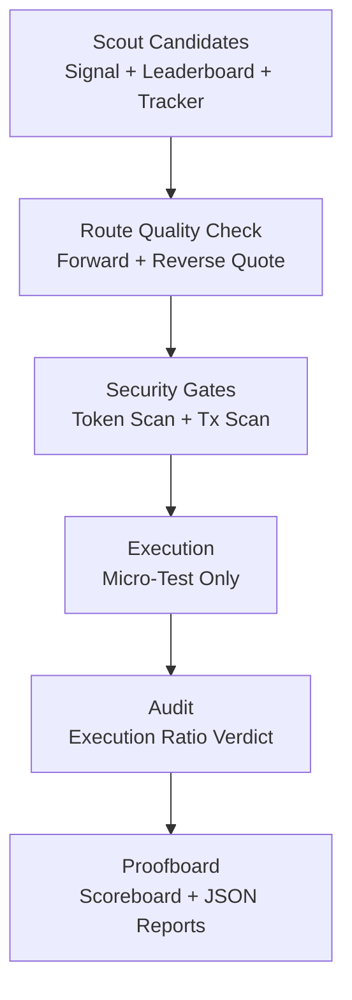

# RouteSentinel

Execution-aware swap safety skill for X Layer.

RouteSentinel helps agents avoid bad swaps by combining candidate scouting, route-quality checks, security gates, micro-test execution, and proof-grade reporting.

## Track

`ProjectSubmission SkillArena`

## Winning Readiness Check (As Of April 15, 2026)

Based on a full paginated scan of `m/buildx` public feed:

- BuildX feed posts analyzed: `4,234`
- Submission-style posts found: `2,530`
- SkillArena submissions found: `16`
- Current top SkillArena post score: `9`

### Where RouteSentinel Is Strong

- Real on-chain execution evidence with tx hashes and machine reports.
- Safety-first design (`token-scan`, `tx-scan`, hard notional cap).
- Reusable skill packaging (`skills/routesentinel-skill`) aligned to plugin-store format.
- Judge-friendly command flow (`npm run judge`).

### What Still Decides 1st Place

- Community traction (upvotes + comments) during final window.
- Clear public positioning and proof narrative.
- Demonstrated integration depth and practical reusability by other agents.

## What RouteSentinel Does

1. `scout`: builds candidate set from live signal + leaderboard + tracker data.
2. Route quality check: evaluates forward quote + reverse quote round-trip quality.
3. Risk gates: blocks critical token risk and critical tx-scan risk.
4. `phasec`: executes dry-run by default; only runs live with explicit confirmation.
5. `proofboard`: outputs reproducible execution/audit scoreboard.

## Why This Matters For Real Users

- Prevents low-quality routes from being selected only by hype signals.
- Reduces catastrophic mistakes using deterministic pre-trade checks.
- Keeps test exposure tiny (`MAX_TEST_USD=0.30` default).
- Produces transparent artifacts that users and judges can verify.

## Architecture



## BuildX Prerequisites

1. Install `onchainos` CLI:

```bash
onchainos --version || curl -fsSL https://raw.githubusercontent.com/okx/onchainos-skills/main/install.sh | sh
```

2. Install OnchainOS skills:

```bash
npx skills add okx/onchainos-skills --yes --global
```

3. Generate your OnchainOS API key:

- https://web3.okx.com/onchainos/dev-portal

4. Install Agentic Wallet:

- https://web3.okx.com/onchainos/dev-docs/wallet/install-your-agentic-wallet

## Judge Quick Start

1. Install dependencies:

```bash
cp .env.example .env
npm install
```

2. Set required values in `.env`:

```env
ONCHAINOS_BIN=onchainos
MAX_TEST_USD=0.30
```

3. Dry-run judge flow (recommended first):

```bash
npm run judge -- --wallet <wallet> --chain xlayer
```

4. Live micro-test (explicit opt-in only):

```bash
npm run judge -- --wallet <wallet> --chain xlayer --confirm-live yes
```

5. Interactive non-technical flow:

```bash
npm run wizard
```

## Core Commands

```bash
npm run plan -- --from <from_token> --to <to_token> --amount <ui_amount> --chain <chain> [--wallet <wallet>]
npm run simulate -- --from <from_token> --to <to_token> --amount <ui_amount> --chain <chain>
npm run execute -- --from <from_token> --to <to_token> --amount <ui_amount> --chain <chain> --wallet <wallet> [--skip-tx-scan yes]
npm run audit -- [--file <proof/reports/...-execute.json>]

npm run intel -- --to <to_token> --chain <chain>
npm run scout -- --chain <chain> [--max-candidates 12]
npm run phaseb -- --from <from_token> --to <to_token> --amount <ui_amount> --chain <chain> --wallet <wallet> --confirm-live yes [--force-intel yes]
npm run phasec -- --from <from_token> --amount <ui_amount> --chain <chain> --wallet <wallet> [--quality-candidates 4] [--to <to_token>] [--confirm-live yes]

npm run proofboard
npm run judge -- --wallet <wallet> --chain <chain> [--confirm-live yes]
npm run wizard
```

## Proof Snapshot

From [`proof/reports/scoreboard.md`](./proof/reports/scoreboard.md):

- Execute reports: `3`
- Audit reports: `3`
- Passing audits: `3`
- Pass rate: `100.00%`
- Average execution ratio: `1.000000`
- Total tested notional: `$0.643950`
- Max single-test notional: `$0.215050`

Recent tx hashes:

- `0x77e54007313708b808c86163749f13e46bce754072379a042a4544aaf83d5fa6`
- `0xa37c9d2c68368c9e488b4fe8348c34fee8089e0535be0c4777b35f118f5feac5`
- `0x62106f435561236f864575997dd733fdf124291cb14594a5fd471198b4d139fe`

## SkillArena Scoring Alignment

Official SkillArena judging dimensions are 25% each.

| Dimension | RouteSentinel Evidence | Current Status |
|---|---|---|
| Integration & Innovation | OnchainOS-driven quote/scan/execute flow, reusable CLI skill packaging | Strong |
| X Layer Fit & On-Chain Activity | X Layer micro-test executions + verifiable tx hashes | Strong |
| AI Interaction & Novelty | Signal-driven candidate selection + route-quality intelligence | Strong |
| Product Completeness & Commercial Potential | End-to-end commands (`judge`, `wizard`), safety defaults, proof outputs | Strong |

## Repository Layout

- `src/cli.mjs`: core command engine (`plan`, `simulate`, `execute`, `audit`, `intel`, `scout`, `phaseb`, `phasec`, `proofboard`)
- `src/judge.mjs`: one-command judge report generator
- `src/wizard.mjs`: interactive runner for non-technical users
- `proof/reports/`: machine-readable execution and scoring artifacts
- `submission/`: generated judge markdown outputs
- `skills/routesentinel-skill/`: plugin-store style skill package

## Official Skill Package

Plugin-store compatible package lives in:

- `skills/routesentinel-skill/plugin.yaml`
- `skills/routesentinel-skill/.claude-plugin/plugin.json`
- `skills/routesentinel-skill/SKILL.md`

## Safety Defaults

- Hard cap: `MAX_TEST_USD=0.30`
- Live execution requires `--confirm-live yes`
- Critical token scan risk blocks simulation/execution
- Critical tx-scan risk blocks execution
- `phasec` defaults to dry-run

## Submission Assets

- Project narrative: [`SUBMISSION.md`](./SUBMISSION.md)
- Aggregate scoreboard: [`proof/reports/scoreboard.md`](./proof/reports/scoreboard.md)
- Judge run sample: [`submission/2026-04-14T19-03-56.779Z-judge-run.md`](./submission/2026-04-14T19-03-56.779Z-judge-run.md)

## License

MIT
