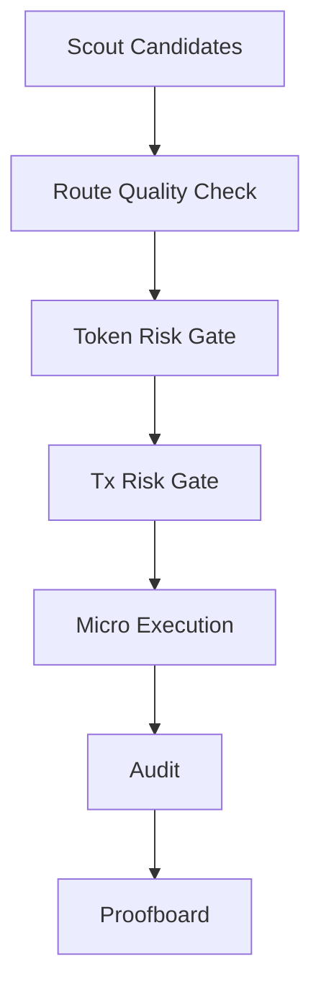

# RouteSentinel

> Execution-aware swap safety skill for autonomous agents on X Layer.

`ProjectSubmission SkillArena`

RouteSentinel is a reusable skill that blocks unsafe swaps before execution. It combines candidate scouting, route-quality checks, token/tx security scanning, and proof-grade reporting in one flow.

## Problem

Agents can execute faster than humans, but most trading flows still fail in two places:

- token risk is checked too late,
- route quality is not validated before spending funds.

Result: bad fills, honeypot exposure, and no transparent proof for users.

## What We Built

RouteSentinel is a fail-closed swap pipeline for X Layer:

1. `scout` discovers candidate tokens from live signal sources.
2. Route-quality guard runs forward + reverse quote checks.
3. `token-scan` gate blocks critical token risk.
4. `tx-scan` gate blocks critical transaction risk.
5. `phasec` runs dry by default and only goes live with explicit confirmation.
6. `proofboard` aggregates machine-readable evidence for judges and users.

## Why This Is Useful

- Safer default behavior for agent swaps.
- Tiny test-notional guardrail (`MAX_TEST_USD=0.30` default).
- One-command judge flow (`npm run judge`) with reproducible artifacts.
- Reusable skill packaging for other agents (`skills/routesentinel-skill/`).

## Architecture



## Quick Start

### 1) Install prerequisites

```bash
onchainos --version || curl -fsSL https://raw.githubusercontent.com/okx/onchainos-skills/main/install.sh | sh
npx skills add okx/onchainos-skills --yes --global
cp .env.example .env
npm install
```

Get OnchainOS API key:
- https://web3.okx.com/onchainos/dev-portal

Install Agentic Wallet:
- https://web3.okx.com/onchainos/dev-docs/wallet/install-your-agentic-wallet

### 2) Configure env

```env
ONCHAINOS_BIN=onchainos
MAX_TEST_USD=0.30
```

### 3) Run judge flow (dry-run first)

```bash
npm run judge -- --wallet <wallet> --chain xlayer
```

### 4) Live micro-test (explicit opt-in)

```bash
npm run judge -- --wallet <wallet> --chain xlayer --confirm-live yes
```

## CLI Commands

```bash
npm run plan -- --from <from_token> --to <to_token> --amount <ui_amount> --chain <chain> [--wallet <wallet>]
npm run simulate -- --from <from_token> --to <to_token> --amount <ui_amount> --chain <chain>
npm run execute -- --from <from_token> --to <to_token> --amount <ui_amount> --chain <chain> --wallet <wallet> [--skip-tx-scan yes]
npm run audit -- [--file <proof/reports/...-execute.json>]

npm run intel -- --to <to_token> --chain <chain>
npm run scout -- --chain <chain> [--max-candidates 12]
npm run phaseb -- --from <from_token> --to <to_token> --amount <ui_amount> --chain <chain> --wallet <wallet> --confirm-live yes [--force-intel yes]
npm run phasec -- --from <from_token> --amount <ui_amount> --chain <chain> --wallet <wallet> [--quality-candidates 4] [--to <to_token>] [--confirm-live yes]

npm run proofboard
npm run judge -- --wallet <wallet> --chain <chain> [--confirm-live yes]
npm run wizard
```

## Safety Model (Fail-Closed)

Trade is blocked if any of these is true:

- notional exceeds `MAX_TEST_USD`,
- token-scan shows critical risk,
- tx-scan shows critical risk,
- live mode requested without `--confirm-live yes`.

## Proof Snapshot

From [`proof/reports/scoreboard.md`](./proof/reports/scoreboard.md):

- Execute reports: `3`
- Audit reports: `3`
- Passing audits: `3`
- Pass rate: `100.00%`
- Average execution ratio: `1.000000`
- Total tested notional: `$0.643950`

Recent tx hashes:

- `0x77e54007313708b808c86163749f13e46bce754072379a042a4544aaf83d5fa6`
- `0xa37c9d2c68368c9e488b4fe8348c34fee8089e0535be0c4777b35f118f5feac5`
- `0x62106f435561236f864575997dd733fdf124291cb14594a5fd471198b4d139fe`

## Skill Package (Plugin-Store Style)

- [`skills/routesentinel-skill/plugin.yaml`](./skills/routesentinel-skill/plugin.yaml)
- [`skills/routesentinel-skill/.claude-plugin/plugin.json`](./skills/routesentinel-skill/.claude-plugin/plugin.json)
- [`skills/routesentinel-skill/SKILL.md`](./skills/routesentinel-skill/SKILL.md)

## Repository Layout

- `src/cli.mjs` - core engine and guardrails
- `src/judge.mjs` - judge report generator
- `src/wizard.mjs` - interactive run flow
- `proof/reports/` - machine-readable artifacts
- `submission/` - generated judge markdown

## Contact

- Telegram: `@shakti0675`
- GitHub: [sambitsargam/RouteSentinel](https://github.com/sambitsargam/RouteSentinel)

## License

MIT
