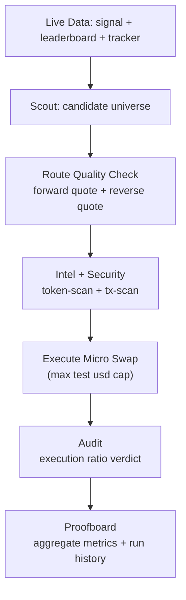

# RouteSentinel Hackathon Submission

## 1) Problem

Most retail users chase signals but fail at execution safety.
Common issues:

- entering risky or manipulated tokens,
- routing through bad liquidity paths,
- no verifiable quality report after a swap.

## 2) Solution

RouteSentinel is an execution-aware swap agent that combines:

- signal intelligence (`signal`, `leaderboard`, `tracker`),
- risk controls (`token-scan`, `tx-scan`),
- route-quality selection (forward + reverse quote),
- micro-test notional caps,
- post-trade audit and proofboard outputs.

## 3) Why It Is Useful For Real Users

- Selects candidates with both market context and tradability checks.
- Rejects high-risk tokens and suspicious tx patterns.
- Shows measurable quality (`executionRatio`, pass rate, notional tracked).
- Keeps initial live tests cheap and controlled.

## 4) Architecture



## 5) Safety Design

- Hard notional cap (`MAX_TEST_USD`, default `$0.30`).
- Explicit live confirmation (`--confirm-live yes`).
- Block on critical token risk.
- Block on critical tx-scan risk.
- Phase C defaults to dry-run.

## 6) Commands For Judges

1. Dry-run full flow:

```bash
npm run judge -- --wallet <wallet> --chain xlayer
```

2. Live micro-test flow:

```bash
npm run judge -- --wallet <wallet> --chain xlayer --confirm-live yes
```

3. Interactive flow for non-technical users:

```bash
npm run wizard
```

## 7) Proof Snapshot (as of April 14, 2026 UTC)

- Execute reports: `3`
- Audit reports: `3`
- Passing audits: `3`
- Pass rate: `100.00%`
- Average execution ratio: `1.000000`
- Total tested notional: `$0.643950`

Recent tx hashes:

- `0x77e54007313708b808c86163749f13e46bce754072379a042a4544aaf83d5fa6`
- `0xa37c9d2c68368c9e488b4fe8348c34fee8089e0535be0c4777b35f118f5feac5`
- `0x62106f435561236f864575997dd733fdf124291cb14594a5fd471198b4d139fe`

Primary evidence files:

- `proof/reports/scoreboard.md`
- `proof/reports/2026-04-14T18-48-48.806Z-phasec.json`
- `proof/reports/2026-04-14T18-56-33.162Z-phasec.json`

## 8) What Makes This Competitive

- It is not just a signal bot; it is an execution-quality agent.
- It includes objective, reproducible proof output.
- It is usable by both technical and non-technical users.
